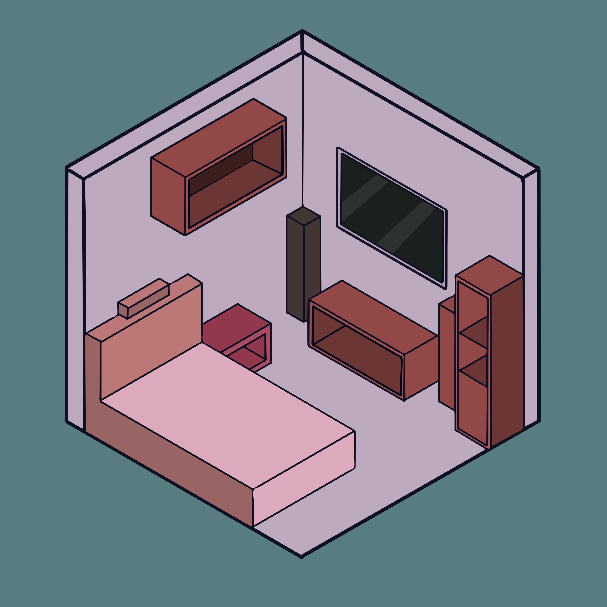

<div align="center">
  
  <h1>Room VSA (Visual Space Analysis)</h1>
</div>

Room VSA is a high-performance, client-side web application for 3D room visualization and interior design. Built with React, Vite, and React Three Fiber, it allows users to dynamically configure room dimensions, swap themes, and manipulate furniture in real-time.

## Features

* **3D Visualization:** Real-time rendering using Three.js and React Three Fiber.
* **Dynamic Configuration:** Adjust room dimensions, wall colors, floor colors, and lighting directly from the control panel.
* **Interactive Furniture:** Add, move, rotate, and customize furniture items like beds, wardrobes, and windows.
* **Local Persistence:** Your room layout is automatically saved securely to your browser's local storage.
* **Import/Export:** Download your room configuration as a JSON file and load it back anytime.

## Technical Architecture

* **Frontend:** React 19, TypeScript
* **3D Engine:** React Three Fiber, Drei, Three.js
* **State Management:** Zustand (with Zod validation for secure persistence)
* **Build Tool:** Vite

## Getting Started

1. Install dependencies:
   ```bash
   npm install
   ```

2. Start the development server:
   ```bash
   npm run dev
   ```

3. Build for production:
   ```bash
   npm run build
   ```

## Security

Room VSA utilizes Zod to strictly validate all configurations loaded from local storage or uploaded via JSON files, ensuring robust protection against client-side injection and DoS attacks.
